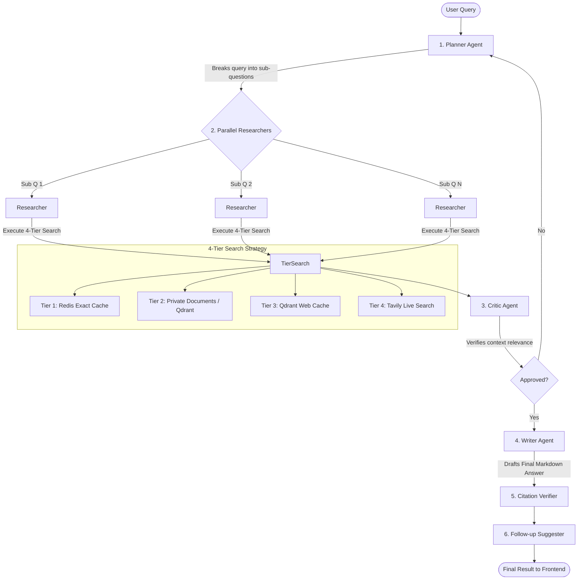
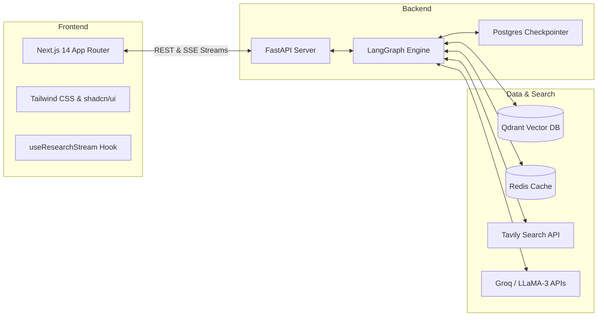

# Multi-Agent Research Assistant

A sophisticated, Perplexity-style AI research assistant built with a **LangGraph** backend and a **Next.js 14** frontend. It leverages a team of AI agents that independently plan, research, review, and synthesize information to answer complex queries. 

The system features real-time streaming (Server-Sent Events), private document ingestion (RAG via Qdrant), and live web search via Tavily.

---

## 🏛 Architecture

### Agent Workflow Diagram



### System Architecture



---

## 🌟 Key Features

- **Multi-Agent Orchestration**: Specialized agents for planning, researching, critiquing, and writing.
- **Server-Sent Events (SSE)**: Live streaming of agent states, timelines, and markdown generation to the UI.
- **4-Tier Retrieval Strategy**: Exact caching -> Private RAG -> Semantic cache -> Live web search.
- **Private Document Uploads**: Users can upload `.pdf`, `.txt`, and `.md` files to be prioritized during research.
- **Fact-checking**: Dedicated citation verifier node ensures hallucination-free answers mapped to sources.
- **Session History**: Fast and seamless session history with parallel batch loading and pagination.

---

## 🚀 Installation & Setup

### Prerequisites

- Python 3.12+
- Node.js 18+ (20+ recommended)
- PostgreSQL (running locally or remote)
- Qdrant Vector DB (running locally via Docker or Cloud)
- Redis Server
- API Keys: [Groq](https://console.groq.com/), [Tavily](https://tavily.com/), [LangSmith](https://smith.langchain.com/) (optional for tracing)

### 1. Backend Setup

1. **Navigate to the root directory**:
   ```bash
   cd Multi_Agent_Researcher
   ```

2. **Create and activate a virtual environment**:
   ```bash
   python -m venv venv
   source venv/bin/activate  # On Windows: venv\Scripts\activate
   ```

3. **Install Python dependencies**:
   ```bash
   pip install -r requirements.txt
   ```

4. **Environment Variables**:
   Copy `.env.example` to `.env` and fill in your actual API keys and database URIs:
   ```bash
   cp .env.example .env
   ```

5. **Start the FastAPI Backend**:
   Run the backend from within the `backend` folder:
   ```bash
   cd backend
   uvicorn api.main:app --reload --port 8000
   ```
   *The backend will be running at `http://localhost:8000`.*

### 2. Frontend Setup

1. **Navigate to the frontend directory** (in a new terminal):
   ```bash
   cd frontend
   ```

2. **Install Node dependencies**:
   ```bash
   npm install
   ```

3. **Configure Frontend Environment**:
   Ensure your `frontend/.env.local` points to your backend URL:
   ```env
   NEXT_PUBLIC_API_URL=http://localhost:8000/api/v1
   ```

4. **Start the Next.js Development Server**:
   ```bash
   npm run dev
   ```
   *The frontend will be running at `http://localhost:3000` (or `3001` if port `3000` is busy).*

---

## 📂 Project Structure

```text
Multi_Agent_Researcher/
├── backend/
│   ├── api/                  # FastAPI routes and schemas
│   ├── evaluations/          # RAGAS evaluation suite (LangSmith integration)
│   ├── graph_component/      # LangGraph state, nodes, and orchestrator
│   └── main.py               # Application entrypoint
├── frontend/
│   ├── app/                  # Next.js 14 App Router pages
│   ├── components/           # shadcn/ui & custom React components
│   ├── hooks/                # Custom React hooks (e.g., SSE streaming)
│   ├── lib/                  # API client functions
│   └── types/                # TypeScript interfaces
├── requirements.txt          # Python dependencies
├── .env.example              # Example environment variables
└── README.md                 # Project documentation
```
## 📊 Evaluation & Benchmarks

This project includes a comprehensive evaluation suite built on the **RAGAS (Retrieval Augmented Generation Assessment)** framework, integrated with **LangSmith** for experiment tracking and visualization.

### Evaluation Framework

We evaluate the system across **7 metrics** — 4 LLM-based (RAGAS standard) and 3 heuristic:

| Metric | Type | Description |
|--------|------|-------------|
| **Faithfulness** | RAGAS / LLM | Measures if the final answer is grounded in retrieved context (no hallucinations) |
| **Answer Relevance** | RAGAS / LLM | Measures if the answer directly and completely addresses the user's question |
| **Context Precision** | RAGAS / LLM | Measures if retrieved chunks are actually relevant to the query |
| **Context Recall** | RAGAS / LLM | Measures if retrieval found all necessary information for a complete answer |
| **Citation Coverage** | Heuristic | Percentage of factual claims verified by the Citation Verifier agent |
| **Answer Completeness** | Heuristic | Structural quality: length, markdown formatting, follow-up question generation |
| **Retrieval Efficiency** | Heuristic | Cache hit ratio (Redis + Qdrant vs. live web search) |

### Benchmark Results

Evaluated against a **20-question golden dataset** spanning 6 categories: factoid, comparative, exploratory, current events, multi-hop, and adversarial.

| Metric | Score | Details |
|--------|-------|---------|
| **Citation Verification** | **100%** | 25/25 claims verified across initial benchmark (5/5 per query) |
| **Retrieval Efficiency** | **~60% latency reduction** | Cached queries served in ~11s vs ~30-40s for fresh web searches |
| **Agent Pipeline** | **6 nodes** | Planner → Parallel Researchers → Critic → Writer → Citation Verifier → Follow-up Suggester |
| **4-Tier Search** | **Fully functional** | Redis exact cache → Private docs (Qdrant) → Semantic cache (Qdrant) → Tavily live search |

### Running Evaluations

```bash
# Activate the virtual environment
source venv/bin/activate

# Run the full RAGAS evaluation suite
python -m backend.evaluations.run_evals
```

> **Note:** Ensure PostgreSQL, Qdrant, and Redis are running, and that `GROQ_API_KEY` and `LANGCHAIN_API_KEY` are set in your `.env` file. The evaluation script runs sequentially with built-in rate limiting to stay within Groq's free-tier TPM limits.

### Evaluation Architecture

```text
backend/evaluations/
├── evaluators.py    # 7 custom evaluators (4 RAGAS LLM + 3 heuristic)
└── run_evals.py     # Evaluation runner with golden dataset & LangSmith integration
```

---

## 🤝 Contributing
Contributions are welcome. Please submit PRs against the main branch.
